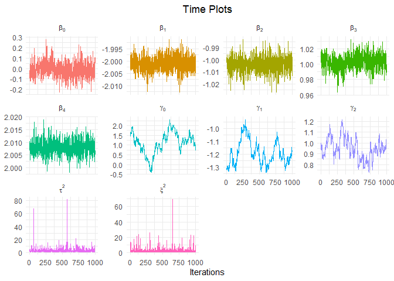
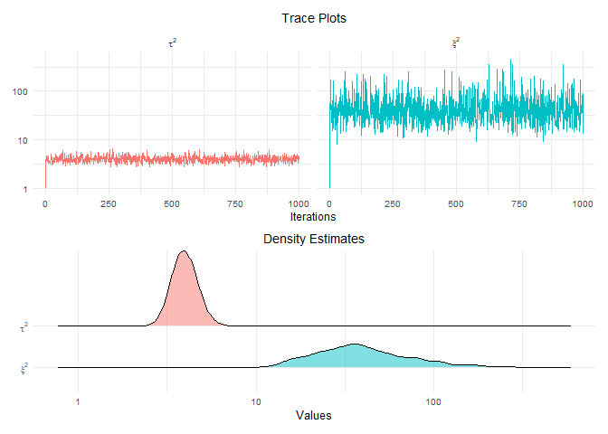
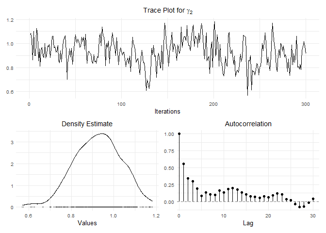

<!-- README.md is generated from README.Rmd. Please edit that file -->

# asp21bridge

The goal of `asp21bridge` is to extend the `lslm` package by
implementing a Markov Chain Monte Carlo Sampler with Ridge penalization.

## Underlying Model

The observation model in consideration is given by <!--  -->

``` math
\begin{aligned}
y_i \sim \mathcal{N} \left( \mathbf{x}_i^T \boldsymbol{\beta},\, \exp \left( \mathbf{ z}_i^T \boldsymbol{\gamma} \right)^2 \right) \qquad i = 1, \ldots n,
\end{aligned}
```

<!--  -->

where the *location* parameter *β* and the *scale* parameter *γ* are
themselves normally distributed with prior mean 0 and *hyperparameters*
*τ*<sup>2</sup> and *ξ*<sup>2</sup> for the prior variances.

## The Data

In the following examples the built-in simulated `toy_data` is used,
which consists of a column `y` representing a vector of observed values
and the explanatory variables `x1`, `x2`, `z1` and `z2`. Here, all
explanatory variables predict the mean of `y` whereas only the latter
two model the variance.

``` r
library(asp21bridge)
head(toy_data)
## # A tibble: 6 x 5
##       y     x1    x2    z1    z2
##   <dbl>  <dbl> <dbl> <dbl> <dbl>
## 1 10.9  -0.207 0.194  5.41  2.62
## 2  6.79  1.28  1.42   4.53  3.10
## 3  9.36  2.08  0.891  5.07  4.64
## 4 10.5  -1.35  0.985  4.50  2.12
## 5  5.76  1.43  1.84   4.17  3.12
## 6  8.47  1.51  2.56   5.17  4.36
```

## Sampling Process

We first fit the frequentist `lslm` regression model and extend this
approach by adding the MCMC samples of the posterior distributions. For
later use, we also apply the MCMC sampler without Ridge - regularization
from the `lslm` package:

``` r
set.seed(1234)

fit <- toy_data %>%
  lslm(location = y ~ ., scale = ~ z1 + z2, light = FALSE) %>%
  mcmc(nsim = 1000) %>%
  gibbs_sampler(num_sim = 1000)
```

## Numerical Analysis

The `asp21bridge` package contains various tools to analyze the sampling
results both numerically and graphically.

A first quick overview can be gained by the generic `summary()` function
with specification of the `type` argument:

``` r
summary(fit, type = "mcmc_ridge")
## 
## Call:
## lslm(location = y ~ ., scale = ~z1 + z2, data = ., light = FALSE)
## 
## Pearson residuals:
##    Min. 1st Qu.  Median    Mean 3rd Qu.    Max. 
## -3.1070 -0.3511  0.1610  0.0505  0.5761  2.8390 
## 
## Location coefficients (identity link function):
##             Mean      2.5%       50%  97.5%
## beta_0  0.002429 -0.002857  0.002419  0.009
## beta_1 -2.000110 -2.000349 -2.000107 -2.000
## beta_2 -1.000220 -1.000688 -1.000213 -1.000
## beta_3  0.999693  0.998893  0.999689  1.000
## beta_4  2.000181  2.000036  2.000181  2.000
## 
## Scale coefficients (log link function):
##            Mean    2.5%     50%  97.5%
## gamma_0  0.1455 -1.2174  0.2008  1.135
## gamma_1 -2.0391 -2.2171 -2.0469 -1.783
## gamma_2  2.0093  1.8266  2.0218  2.162
## 
## Residual degrees of freedom: 42 
## Log-likelihood: 131.3 
## AIC: -246.6 
## BIC: -231.3
```

A more comprehensive list of the estimated parameter values is provided
by the `summary_complete()` function:

``` r
summary_complete(fit)
## # A tibble: 10 x 6
##    Parameter `5% Quantile` `Posterior Mean` `Posterior Median` `95% Quantile`
##    <chr>             <dbl>            <dbl>              <dbl>          <dbl>
##  1 beta_0         -0.00212          0.00243            0.00242        0.00719
##  2 beta_1         -2.00            -2.00              -2.00          -2.00   
##  3 beta_2         -1.00            -1.00              -1.00          -1.00   
##  4 beta_3          0.999            1.00               1.00           1.00   
##  5 beta_4          2.00             2.00               2.00           2.00   
##  6 gamma_0        -0.982            0.145              0.201          0.954  
##  7 gamma_1        -2.20            -2.04              -2.05          -1.80   
##  8 gamma_2         1.86             2.01               2.02           2.15   
##  9 tau^2           0.961            3.12               2.22           7.75   
## 10 xi^2            1.08             5.11               3.11          13.6    
## # ... with 1 more variable: Standard Deviation <dbl>
```

Since the results are embedded in a `data frame`, the usual methods of
data frame manipulation allow for a convenient analysis even for high
dimensional parameter vectors. A particularly interesting use case is
the comparison of the coefficient estimates from the following three
approaches:

-   Point estimates based on Maximum Likelihood Estimation (`mle`
    column)

-   Posterior Mean estimates from MCMC sampling without regularization
    (`mcmc` column)

-   Posterior Mean estimates with Ridge penalty (`mcmc_ridge` column)

Both the `mcmc()` function as well as the `gibbs_sampler()` function
simply add their results to the existing model. Therefore all relevant
information is contained in the `fit` object from above:

``` r
summary_complete(fit) %>%
  dplyr::transmute(Parameter, mcmc_ridge = `Posterior Mean`) %>%
  dplyr::filter(stringr::str_detect(Parameter, pattern = "beta|gamma")) %>%
  dplyr::mutate(
    mcmc = summary_complete(fit$mcmc)$`Posterior Mean`,
    mle = c(coef(fit)$location, coef(fit)$scale)
  )
## # A tibble: 8 x 4
##   Parameter mcmc_ridge     mcmc      mle
##   <chr>          <dbl>    <dbl>    <dbl>
## 1 beta_0       0.00243  0.00225  0.00184
## 2 beta_1      -2.00    -2.00    -2.00   
## 3 beta_2      -1.00    -1.00    -1.00   
## 4 beta_3       1.00     1.00     1.00   
## 5 beta_4       2.00     2.00     2.00   
## 6 gamma_0      0.145    0.920    1.13   
## 7 gamma_1     -2.04    -2.16    -2.29   
## 8 gamma_2      2.01     1.96     2.07
```

The estimates for *β*<sub>1</sub> up to *β*<sub>4</sub> are identical in
the three models and coincide with the true data generating values. This
behaviour is somewhat expected since the *β* vector is drawn from a
closed form multivariate normal distribution with independent samples
across iterations of the MCMC sampler.

The results for the scale parameter *γ* show a greater variation between
the models and are therefore more interesting to analyze. The Markov
Chain Monte Carlo samples based on the Metropolis - Hastings algorithm
implemented in the `gibbs_sampler()` function are strongly correlated,
even though the acceptance rate of the proposed values is reasonable:

``` r
fit$mcmc_ridge$acceptance_rate
## [1] 0.43
```

This value of roughly 43% indicates that the variance of the proposal
distribution is chosen appropriately.

## Graphical Analysis

The building blocks for monitoring the convergence of the posterior
chains as well as the autocorrelations are the functions
`diagnostic_plots()` for a single Markov Chain and `mult_plot()` for
combining multiple chains.

A quick overview can be gained by collecting the corresponding time
plots for all posterior coefficients.

``` r
mult_plot(fit, type = "time", free_scale = TRUE, latex = TRUE, robust = TRUE)
```



The time plots for the *β* coefficients indicate convergence and confirm
the stable posterior estimates from the previous section.

The prior variance parameters *τ*<sup>2</sup> and *ξ*<sup>2</sup> are
strictly positive and thus more adequately displayed on the logarithmic
scale:

``` r
samples <- fit$mcmc_ridge$sampling_matrices
mult_plot(
  samples = list(samples$location_prior, samples$scale_prior),
  type = "both", log = TRUE, latex = TRUE
)
```



Just like the *β* samples, these are drawn from closed form full
conditional distributions.

Finally, we focus on the samples for the scale parameter *γ*. Here, the
time plots do not indicate convergence to the posterior distribution.
Thus, we increase the number of simulations to 10000, which also allows
the inclusion of a Burn - In Phase as well as a thinning factor while
still maintaining a sufficient sample size to estimate posterior
quantities:

``` r
set.seed(4321)

fit <- fit %>% 
  gibbs_sampler(num_sim = 10000)
```

We drop the first 1000 samples for *γ*<sub>2</sub> and show the three
most common diagnostic plots for the thinned sample:

``` r
samples <- fit$mcmc_ridge$sampling_matrices

samples$scale[, 3, drop = FALSE] %>%
  burnin(num_burn = 1000) %>% 
  thinning(freq = 30) %>%
  diagnostic_plots(lag_max = 30, latex = TRUE)
```



Even a thinning factor of 30, i.e. only every 30th observation is kept
in the sample, does not get rid of the autocorrelation. The posterior
density seems to be approximately normal though and the time plot
indicates a decent exploration of the posterior space.

These findings serve as a great starting point for a more in-depth
analysis, which is beyond the scope of this brief introduction to the
`asp21bridge` package. Full descriptions of all functions, their
arguments and common applications can be found in the documentation.
