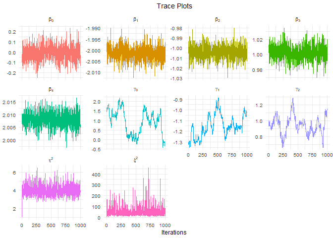

<!-- README.md is generated from README.Rmd. Please edit that file -->

# lslmbRidge

The goal of `lslmbRidge` is to extend the `lslm` package by implementing
a Markov Chain Monte Carlo Sampler with Ridge penalization.

## Underlying Model

The observation model in consideration is given by <!--  -->

``` math
\begin{aligned}
y_i \sim \mathcal{N} \left( \mathbf{x}_i^T \boldsymbol{\beta},\, \exp \left( \mathbf{ z}_i^T \boldsymbol{\gamma} \right) \right) \qquad i = 1, \ldots n, 
\end{aligned}
```

<!--  -->

where the *location* parameter
$\`\\boldsymbol{\\beta} = \\begin{pmatrix} \\beta\_0 & \\cdots & \\beta\_K \\end{pmatrix}\`$
and the *scale* parameter
$\`\\boldsymbol{\\gamma} = \\begin{pmatrix} \\gamma\_0 & \\cdots & \\gamma\_L \\end{pmatrix}\`$
are themselves normally distributed with prior mean 0 and
*hyperparameters* $\`\\tau^2\`$ and $\`\\xi^2\`$ for the prior variances
.

## The Data

In the following examples the built-in simulated `toy_data` is used,
which consists of a column `y` representing a vector of observed values
and the explanatory variables `x1`, `x2`, `z1` and `z2`. Here, all
explanatory variables predict the mean of `y` and only the latter two
model the variance.

``` r
library(lslmbRidge)
head(toy_data)
## # A tibble: 6 x 5
##       y     x1    x2    z1    z2
##   <dbl>  <dbl> <dbl> <dbl> <dbl>
## 1  29.0 -0.207 0.194  5.41  2.62
## 2  23.3  1.28  1.42   4.53  3.10
## 3  30.8  2.08  0.891  5.07  4.64
## 4  18.7 -1.35  0.985  4.50  2.12
## 5  19.8  1.43  1.84   4.17  3.12
## 6  23.7  1.51  2.56   5.17  4.36
```

## Sampling Process

We first apply the usual regression model based on Maximum - Likelihood
estimation implemented in the `lslm` model and enhance this approach by
adding the MCMC samples of the posterior distributions:

``` r
set.seed(1234)

fit <- toy_data %>%
  lslm(location = y ~ ., scale = ~ z1 + z2, light = FALSE) %>%
  gibbs_sampler(num_sim = 1000)
## Model object chosen for further calculations.
```

## Numerical Analysis

The `lslmbRidge` package contains various tools to analyze the sampling
results both numerically and graphically.

A first quick overview can be gained by the generic `summary()`
function:

``` r
summary(fit, type = "mcmc_ridge")
## 
## Call:
## lslm(location = y ~ ., scale = ~z1 + z2, data = ., light = FALSE)
## 
## Pearson residuals:
##     Min.  1st Qu.   Median     Mean  3rd Qu.     Max. 
## -3.07000 -0.55750  0.06667  0.00000  0.59940  2.27500 
## 
## Location coefficients (identity link function):
##           Mean    2.5%     50%  97.5%
## beta_0  0.6810 -0.7828  0.6806  2.098
## beta_1  2.2194  1.8784  2.2203  2.555
## beta_2 -4.0164 -4.2780 -4.0244 -3.707
## beta_3  4.9386  4.6695  4.9422  5.208
## beta_4  0.9147  0.6955  0.9178  1.133
## 
## Scale coefficients (log link function):
##              Mean      2.5%       50% 97.5%
## gamma_0 -0.220360 -0.601008 -0.190793 0.100
## gamma_1  0.039030 -0.085464  0.043419 0.154
## gamma_2  0.026578 -0.135393  0.008777 0.205
## 
## Residual degrees of freedom: 42 
## Log-likelihood: -68.83 
## AIC: 153.7 
## BIC: 169
```

A more comprehensive list of the estimated parameter values is provided
by the `summary_complete()` function:

``` r
results <- summary_complete(fit)
results
## # A tibble: 10 x 6
##    Parameter `5% Quantile` `Posterior Mean` `Posterior Median` `95% Quantile`
##    <chr>             <dbl>            <dbl>              <dbl>          <dbl>
##  1 beta_0         -0.509             0.681             0.681           1.80  
##  2 beta_1          1.93              2.22              2.22            2.50  
##  3 beta_2         -4.25             -4.02             -4.02           -3.76  
##  4 beta_3          4.70              4.94              4.94            5.17  
##  5 beta_4          0.722             0.915             0.918           1.11  
##  6 gamma_0        -0.555            -0.220            -0.191           0.0717
##  7 gamma_1        -0.0685            0.0390            0.0434          0.140 
##  8 gamma_2        -0.122             0.0266            0.00878         0.185 
##  9 tau^2           0.00534           0.0154            0.0118          0.0309
## 10 xi^2            0.0604            0.227             0.152           0.608 
## # ... with 1 more variable: Standard Deviation <dbl>
```

Since the results are embedded in a `data frame` the usual methods of
data frame manipulation allow for a convenient analysis even for high
dimensional parameter vectors. For the sake of illustration we can
easily sort all scale parameters by their standard deviation:

``` r
results %>%
  dplyr::select(Parameter, `Standard Deviation`) %>%
  dplyr::filter(stringr::str_detect(Parameter, pattern = "gamma")) %>%
  dplyr::arrange(dplyr::desc(`Standard Deviation`))
## # A tibble: 3 x 2
##   Parameter `Standard Deviation`
##   <chr>                    <dbl>
## 1 gamma_0                 0.176 
## 2 gamma_2                 0.103 
## 3 gamma_1                 0.0609
```

## Graphical Analysis

The building blocks of monitoring the convergence of the posterior
chains as well as the autocorrelation are the functions
`diagnostic_plots()` for a single Markov Chain and `mult_plot()` for
combining multiple chains.

First we analyze the convergence of the location coefficients. Note that
the posterior samples are saved in the list entry
`mcmc_ridge$coefficient_sampling_matrices`:

``` r
samples <- fit$mcmc_ridge$coefficient_sampling_matrices

mult_plot(
  samples = samples$location, type = "both",
  free_scale = TRUE, latex = TRUE
)
## Picking joint bandwidth of 0.0582
```


We can observe stable time plots indicating convergence and a sufficient
exploration of the posterior space as well as approximate normal
posterior distributions for *β*<sub>1</sub> up to *β*<sub>4</sub>.

While time plots, density plots and autocorrelation plots can always be
displayed separately, it is often convenient to combine all of them in a
single plot. This can be achieved with the `diagnostic_plots()` function
as demonstrated below. Since the variance parameter *ξ*<sup>2</sup> is
strictly positive, we choose a logarithmic scale:

``` r
diagnostic_plots(samples = samples$scale_prior, log = TRUE, latex = TRUE)
```



All three plots confirm the validity of the posterior distribution
estimates. In this case there is neither a thinning procedure nor a
Burn-In phase necessary, which are implemented by the functions
`thinning()` and `burnin()`.
